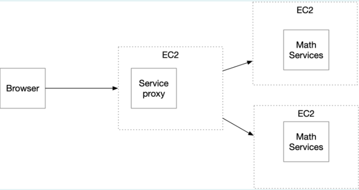
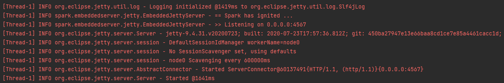
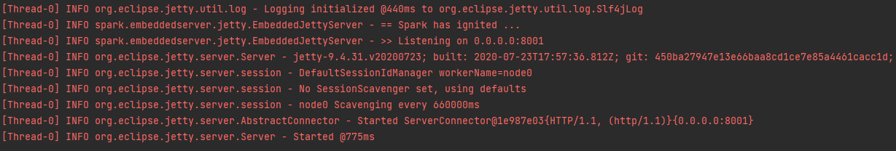
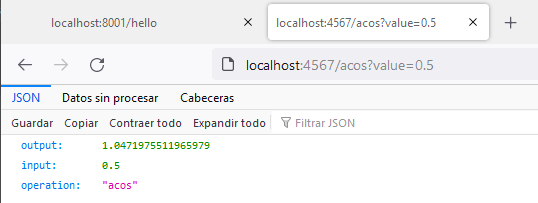
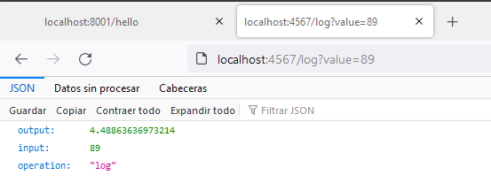
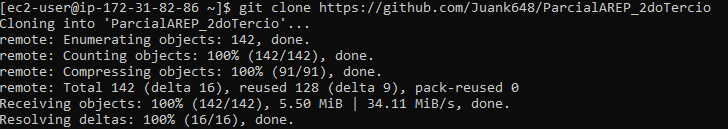
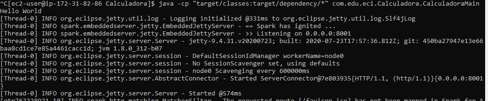
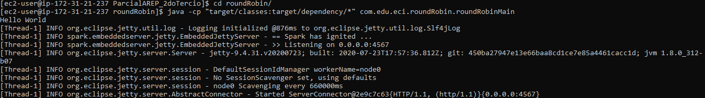
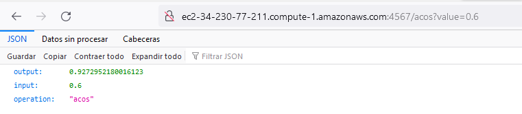

# Parcial Segundo Tercio -Service Proxy y Calculadora microservicios en EC2

## Escuela Colombiana de Ingeniería - Enterprise Architectures(AREP).

Se realizo una implementacion de un service proxy y una calculadora de microservicios en distintas instancias de EC2

## Empezando

### Requerimientos
Diseñe un prototipo de calculadora de microservicios que tenga un servicios de matemáticas con al menos dos funciones implementadas y desplegadas en al menos dos instancias virtuales de EC2. Además debe implementar un service proxy que recibe las solicitudes de servicios y se las delega a las dos instancias usando un algoritmo de round-robin. Asegúrese que se pueden configurar las direcciones y puertos de las instancias en el porxy usando variables de entorno del sistema operativo. Cada estudiante debe seleccionar para desarrollar dos funciones matemáticas de acuerdo a los dos últimos dígitos de su cédula como se especifica en la lista (Si sus dos últimos dígitos de su cédula son el mismo use el siguiente dígito que sea diferente). Todas las funciones reciben un solo parámetro de tipo "Double" y retornan una parámetro de tipo "Double"



0. log
1. ln
2. sin
3. cos
4. tan
5. acos
6. asin
7. atan
8. sqrt
9. exp (el número de eauler elevado ala potendia del parámetro)

Implemente los servicios para responder al método de solicitud HTTP GET. Deben usar el nombre de la función especificado en la lista y el parámetro debe ser pasado en la variable de query con nombre "value".

El proxy debe delegar el llamado a los servicios de backend. El proxy y los servicios se deben implementar en Java usando Spark.


Ejemplo de una llamado:

EC2
https://amazonxxx.x.xxx.x.xxx:{port}/cos?value=3.141592

Salida. El formato de la salida y la respuesta debe ser un JSON con el siguiente formato

{

 "operation": "cos",

 "input":  3.141592,

 "output":  -0.999999

}


### Prerrequisitos

- [Maven](https://maven.apache.org/) - Dependency Management.

- [Java 8](https://www.oracle.com/co/java/technologies/javase/javase-jdk8-downloads.html) -  Development Environment.

- [Git](https://git-scm.com/) - Version Control System.

- [Spark](http://sparkjava.com/) - Micro framework for creating web applications in Java 8.


### LocalHost

Ejecucion local

1. Ejecutamos roundRobin en el puerto 4567:



2. Ejecutamos Calculadora en el puerto 8001:



3. Le pedimos que calcule el arcocoseno de 0.5:



4. Le pedimos el logaritmo de 89:



### Amazon EC2

1. Creamos tres instancias de Amazon EC2
2. Dedicamos una instancia para Calculadora 1
3. Ingresamos a la misma por medio de SSH
4. Instalamos jdk 8:

```
sudo yum install java-1.8.0-openjdk
```

5. Instalamos git: 

```
sudo yum install git
```

6. Clonamos el repositorio:

```
git clone https://github.com/Juank648/ParcialAREP_2doTercio
```



7. Accedemos a ParcialAREP_2doTercio

```
cd ParcialAREP_2doTercio
```

8. Accedemos a Calculadora

```
cd Calculadora
```

9. Ejecutamos la aplicacion:

```
java -cp "target/classes:targer/dependency/*" com.edu.eci.Calculadora.CalculadoraMain
```


10. Repetimos los pasos del 3 al 9 para la segunda instancia de Calculadora
11. Repetimos los pasos del 3 al 7 para la tercera instancia correspondiente a Proxy
12. Ejecutamos lo siguiente:


#### Pruebas EC2

Desde el proxy probamos a calcular el arcocoseno de 0.6:



Ahora el logaritmo de 56:


Prueba en video en el archivo Demo

## Autor
Juan Carlos Alayon Molina


